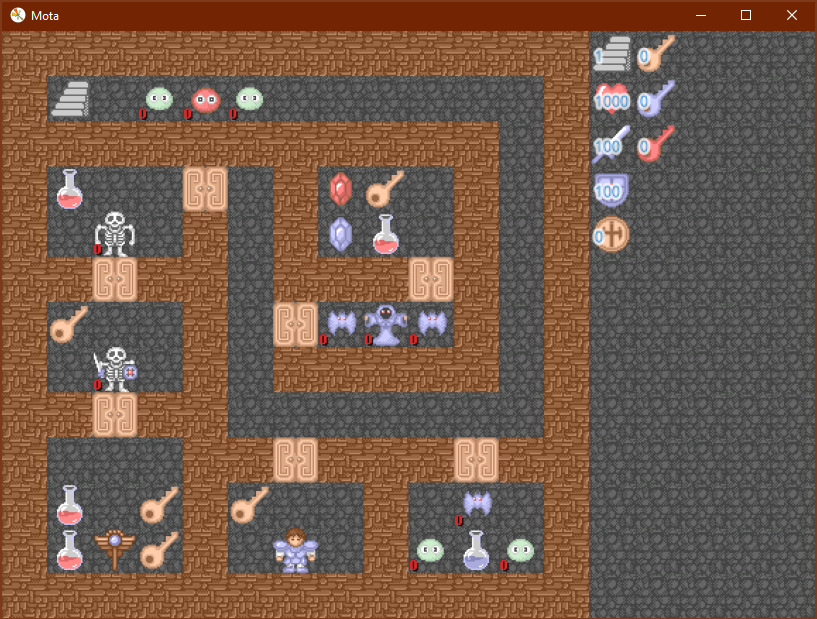

# 魔塔



## 安装方式

安装依赖：

    pip install -r requirements.txt

执行程序：

    python main.py

## 使用方式

- 上下左右键 或者 鼠标点击 控制英雄移动
- pageup 或者 f 向上一层
- pagedown 或者 d 向下一层
- ctrl+s 保存状态
- ctrl+l 恢复状态
- ctrl+z 撤销操作
- ctrl+n 重置
- 1234 商店和祭坛的选择方法
- qwertyuio 用于不同装备，图标上有标明
- s 搜索快捷键（实验功能）


## 相关信息

我最初的记忆是，小时候好记星学习机上的游戏，当时怎么搞都没办法通关。经过了无数的尝试与失败。又来到了怀旧的事件，于是想着再玩一下，然后找到了一个网页 h5mota [^h5mota]，可以直接玩。

但是，根据网上的各种信息，一开始的游戏是 flash 小游戏，于是想恢复一下最开始的 flash，于是找到了相关游戏的 swf 文件 [^swf]，不过要运行 swf 还需要 flash 插件，但是 flash 插件已经 停止支持了，而中国大陆地区的代理特别恶心，是个流氓软件。所以想着能不能使用沙盒或者 docker 的方式来运行。

首先试了 Windows Sandbox，发现无法安装 flash player，最后会跳转带代理的网页。

然后就尝试使用 docker，使用 docker 相当简单，当然前提是首先会使用 docker，使用 docker 已经算是一个门槛了。假设已经会使用 docker，那么就简单了。

将 [Dockerfile](../00/mota/dockerfile) 和 [mota.swf](../00/mota/mota.swf) 文件拷贝到同一个目录，然后执行：

    docker build -t mota .

编译 docker 镜像，然后启动 mota

```sh
docker run --rm\
    --name mota \
    -e DISPLAY=$DISPLAY \
    -v /tmp/.X11-unix:/tmp/.X11-unix \
    mota
```

综合玩下来，感觉网页版更方便，操作起来更好。

## 关键节点

- 3 层老人有 **怪物手册**；
- 5 层有 **铁剑**；
- 1 层有 **飞行法杖**；
- 5 层有 **记事本**；
- 9 层有 **铁盾**；
- 11 层有 **银盾**；
- 17 层有 **银剑**；
- 12 层商人有 **红钥匙**，800 金币；
- 12 层需要购买两次攻击；
- 5 9 12 14 16 18 层有暗墙；
- 14 层左上角三个怪打完，有一把 **红钥匙**；
- 19 层中间有 **十字架**；
- 25 层是魔塔的主人；
- 33 层有 **骑士剑**；
- 34 层中间八个怪打完有 **红钥匙**；
- 2 层的怪可以打了；
- 38 层有 **骑士盾**；
- 39 层的门开 中上和中右（三点）；
- 43 层有 **圣盾**；
- 45 层有 **上楼机**；
- 43 层使用上楼机到 44 层，有 **神圣盾**；
- 41 层对称右侧怪打完会出现 **下楼机**；
- 1 层使用 **下楼机**，到 0 层 有 **金币**；
- 46 层有 **钥匙**；
- 47 层有 **地震卷轴**；
- 48 层有 **圣剑**，需要用到 **瞬移**；
- 49 层魔王，需要先打掉 **上下左右** 的怪；
- 13 层有 **神圣剑**；

伤害计算规则：

防御方生命力 = 防御方生命力 - 攻击方攻击力 + 防御方防御力；

## 具体细节

其中主要的算法是勇士打怪的血条的算法，设：

- 勇士的血条 $w_h$
- 勇士的攻击 $w_a$
- 勇士的防御 $w_d$
- 怪物的血条 $m_h$
- 怪物的攻击 $m_a$
- 怪物的防御 $m_d$

勇士对怪物造成的伤害为 $h_m = w_a - m_d$，若 $h_m \leqslant 0$，则无法攻击此怪；

怪物对勇士造成的伤害为 $w_m = m_a - w_d$，若 $w_m \leqslant 0$，则可以无伤害的攻击磁怪；

在攻击有效 $h_m > 0$ 的情况下的第 $t$ 次攻击后：

$$
m_{h_{t+1}} = m_{h_t} - w_a + m_d
$$

若 $m_{h_{t+1}} \leqslant 0$，则攻击结束；

否则若 $w_m > 0$，更新勇士的血条：

$$
w_{h_{t+1}} = w_{h_t} - m_a + w_d
$$

攻击从夫进行，直至攻击结束；

对于 RPG(Role Playing Game) 游戏而言，这里还有一个术语 **临界**，表示 上面的攻击过程 $t = 0$ 开始直到攻击结束 $t = k$，随着勇士攻击和防御的升级，当攻击次数 $k$ 的值变化时，则称为一个 **临界**。

## References

[^h5mota]: <https://h5mota.com/games/51/>
[^swf]: <http://gameschool.cc/game/173/>
- <https://gajduk-andrej.medium.com/running-flash-player-with-docker-e63dc083cc9>
